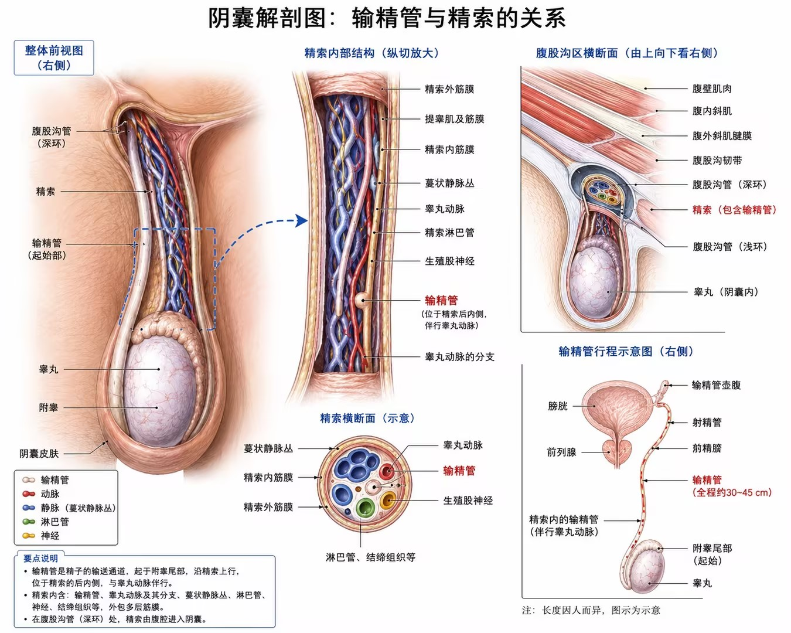

<!-- markdownlint-disable MD025 MD033 MD060 -->
# 输精管灌注的注意事项

- [返回目录](./README.md)
- 另请参见：[灌注与射精](【信息】输精管灌注与射精.md) | [灌注的操作](./【信息】输精管灌注的操作.md) | [灌注的注意](【信息】输精管灌注注意事项.md)

## 1. 强制舒展阴囊

- **尚无** 前列地尔（前列腺素E1）用于阴囊放松
  - 医学文献中，前列地尔主要用于阴茎海绵体注射（治疗勃起功能障碍）
  - 维持新生儿动脉导管开放
  - 无标准阴囊注射方案用于放松dartos肌或cremaster肌
- **位置**
  - 参考类似肌肉放松技术（如肉毒素注射）
  - 可能针对阴囊前侧皮下、根部附近，或dartos肌层
  - 避开主要血管、输精管和睾丸
- **剂量**
  - 阴茎海绵体注射起始剂量通常5-10μg，最大单次不超过60μg，需医生个体化调整
  - 无可靠数据支持阴囊注射。
  - 阴茎注射起始剂量通常为5-10μg，最大单次不超过60μg
  
## 2. 灌注时感到疼痛

- 顺行灌注
  - 缓慢推注（0.3-0.5 mL/秒）、少量多次时，常见轻微牵拉感、温热感或下腹/会阴胀感
  - 灌注量2-3 mL主要达睾丸-附睾段，3-5 mL达壶腹，5-7 mL可能明显胀感，超过7 mL易致胀痛
- 反向穿刺
  - 刺激更显著，易引起局部牵拉痛、下腹牵涉痛，容量耐受低（0.5-1.5 mL）
- 利多卡因
  - 可减少粘膜刺激和疼痛
  - 可能缓解轻中度胀痛或不适
  - 对深部或压力性疼痛效果不确定
- 总体
  - 操作前实施局部麻醉（2-5 mL利多卡因）可显著减轻
  - 类似输精管相关操作多在局麻下进行，患者耐受性较好
  - 个体差异存在，部分可能出现术后不适或慢性疼痛

## 3. PTFE留置管长度

- 推荐2-3 Fr PTFE微导管（外径0.67-1.0 mm），适配输精管内径
- 输精管内保留长度
  - 需进入管腔足够深度以确保稳定和有效灌注
  - 通常几厘米，视顺行目标如壶腹段而定，通过导丝辅助置入
  - 过短易脱出，过长增加损伤/阻塞风险
- 皮肤外固定长度
  - 保留足够长度（几厘米至10+ cm）用于外部固定和连接注射泵
  - 用无菌胶带或缝合固定于皮肤，避免牵拉

## 4. 显色灌注液

- 基础液
  - 生理盐水或5%葡萄糖
- 显色添加
  - 肉眼显色：亚甲基蓝（Methylene Blue） 0.1-0.5%
  - 造影显色：碘帕醇 或 碘海醇（300 - 600 mg/mL）
- 液体应预热至接近体温，减少不适
